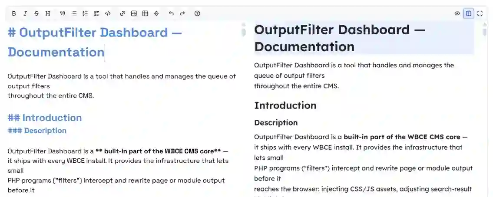

# PlainMDE

A lightweight Markdown editor for WBCE CMS — toolbar, live preview
(side-by-side or toggled), fullscreen mode, and GFM checklist support.
Built on top of [CodeMirror 5](https://codemirror.net/5/), which WBCE
already ships via `modules/CodeMirror_Config` — so loading PlainMDE costs
almost nothing on a page that has that module active for other reasons.



It's a ground-up rewrite, not a bundled/transpiled copy of EasyMDE or
SimpleMDE, though it carries over a similar toolbar layout and several UX
conventions by design. 
See [NOTICE.md](NOTICE.md) for the full design lineage and third-party licenses 
of what *is* vendored (CodeMirror addons, Tabler Icons).

## Usage

Load it via WBCE's asset-plugin loader from any PHP entry point:

```php
I::loadPlugin('include/PlainMDE');
```

Then attach it to a `<textarea>` on the client side:

```js
var editor = new PlainMDE({
    element: document.getElementById('my-textarea'),
    toolbar: PlainMDE.defaultToolbar,
    lineWrapping: true,
    maxHeight: '500px'
});
```

PlainMDE keeps the underlying `<textarea>`'s value in sync on every
keystroke, so a plain (non-JS) form submit works unmodified — no special
serialization step needed before posting the form.

Optional pieces, loaded the same way:

- `PlainMDEDecorations.attach(editor.codemirror)` — heading-size preview,
  fenced-code-block background, GFM checklist styling.
- `PlainMDESync.attach(editor)` — cursor↔preview block highlighting.
- `previewRender` option — override the markdown→HTML renderer entirely
  (e.g. to rewrite relative image paths against a document's own
  directory; see `modules/MarkdownWbce/layout/reader.htt` for a working
  example).

Current consumers in this codebase: `modules/cwsoft-addon-file-editor`,
`modules/tinymce_wbce`, `modules/ves`, `modules/tiptap_editor`,
`modules/elfinder`, and `modules/MarkdownWbce`'s reader/editor.

### Theming

Every color/font/spacing value is a CSS custom property on `.PlainMDE`
(`--pmde-*`) — retheme via `include/PlainMDE/css/plainmde-overrides.css`
without touching `plainmde.css` itself. A consuming page can also scope its
own dark-mode overrides under a wrapper class of its own choosing (see
`modules/MarkdownWbce/layout/style.css` / `plainmde.css`'s `.mdr-pmde-theme`
block for a worked example) — PlainMDE itself stays theme-neutral by
default so it doesn't impose a dark mode on consumers that never asked for
one.

## License

MIT — see [LICENSE](LICENSE). Third-party vendored code (CodeMirror
addons, Tabler Icons) keeps its own MIT license; see
[NOTICE.md](NOTICE.md).

## History

Started as a WBCE-specific fork of EasyMDE, then rewritten from the ground
up as its own independent component — no EasyMDE/SimpleMDE source remains,
only the toolbar layout and a few UX conventions carried over by design.
Since then: GFM checklist continuation, cursor↔preview sync, an elFinder
image-picker bridge, and (most recently) full CSS-variable theming so
consuming pages can retheme it — including dark mode — without patching
this project's own stylesheet.

## Authors

Christian M. Stefan ([wbEasy.de](https://www.wbeasy.de))
