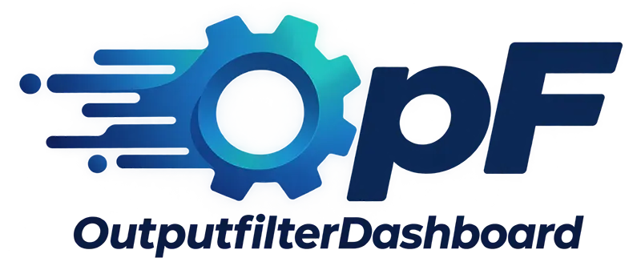

# OutputFilter Dashboard

**Zentrale Verwaltung der Outputfilter-Pipeline von WBCE.**

Jede Seite, die WBCE ausliefert, durchläuft eine Kette von *Outputfiltern* —
kleine PHP-Funktionen, denen das fertige HTML übergeben wird und die es
umschreiben dürfen, bevor es beim Browser ankommt. Stylesheets und Skripte
einfügen, Link-Tokens auflösen, Droplet-Aufrufe ausführen, Suchtreffer
hervorheben: all das ist ein Filter auf dieser Kette.

Das OutputFilter Dashboard besitzt diese Kette. Es führt sie bei jedem Request
aus und gibt dir einen Bildschirm, auf dem du jeden Filter siehst: ein- und
ausschalten, umsortieren, auf bestimmte Seiten oder Module beschränken, neue
installieren.

Es gehört zum WBCE-Kern und ist auf jeder Installation aktiv — zu finden unter
**Admin-Tools → Output Filter Dashboard**.

---

## Was es mitbringt

- **Zwei Ebenen, sieben geordnete Stufen.** Ein Filter kann auf der Ausgabe
  einer einzelnen Section laufen oder auf der komplett zusammengebauten Seite,
  jeweils mit den Varianten *first* / *last* / *final* — keine flache,
  ungeordnete Kette.
- **Feingranulare Eingrenzung.** Ein Filter lässt sich auf bestimmte Module,
  bestimmte Seiten, eine Seite samt allen Unterseiten oder das WBCE-Backend
  beschränken — er läuft also nur dort, wo er gebraucht wird.
- **Drei Wege, ein API.** Ein Filter kann ein Schnipsel sein, das direkt im Tool
  eingetippt wird, ein eigenständiges ZIP-Plugin oder Code, der in einem anderen
  Modul mitgeliefert wird — registriert wird alles über denselben Aufruf von
  `opf_register_filter()`.
- **Eine Sicherheitsschranke.** Filtercode läuft durch die Syntax- und
  Sicherheitsprüfung `CodeVet`, bevor er überhaupt in die Datenbank geschrieben
  wird.

## Filter, die mit WBCE mitkommen

Ab Werk registriert und aktiv, in der Reihenfolge ihrer Ausführung:

| Filter                     | Stufe        | Was er tut                                                                                               |
| -------------------------- | ------------ | -------------------------------------------------------------------------------------------------------- |
| **Colorbox**               | Page (first) | Lädt die Colorbox-Lightbox für Links mit `class="colorbox"`, `iframe`, `youtube`, …                      |
| **Internal Link Replacer** | Page         | Löst die Tokens `[pagelink:NN]`, `[wblinkNN]` und `[<modul>:NN]` in echte URLs auf.                      |
| **Droplets Injector**      | Page         | Führt Droplet-Aufrufe (`[[name]]`) aus. Wird von `modules/droplets` registriert, nicht von diesem Modul. |
| **Replace Contents**       | Page (last)  | Ersetzt markierte Inhalte oder Code innerhalb von Platzhalter-Blöcken.                                   |
| **Class Insert Helper**    | Page (last)  | Löst die AssetQueue-Injektion aus — schreibt eingereihtes CSS/JS/HTML an die richtigen Stellen.          |
| **Remove System PH**       | Page (final) | Entfernt alle `<!--(PH)...-->`-Marker, die in der fertigen Seite übrig sind.                             |
| **Assets Cache Busting**   | Page (final) | Hängt `?<mtime>` an CSS-/JS-URLs, damit Browser keine veralteten Dateien mehr ausliefern.                |

*Internal Link Replacer*, *Replace Contents*, *Class Insert Helper* und *Remove
System PH* kommen gemeinsam als ein Plugin, `plugins/core_outputfilters/`;
*Colorbox* und *Assets Cache Busting* sind jeweils eigene Plugins, und der
*Droplets Injector* wird vom Droplets-Modul registriert.

## Dokumentation

| Dokument                                                  | Für wen                                                                       |
| --------------------------------------------------------- | ----------------------------------------------------------------------------- |
| [Handbuch](documentation/USER_GUIDE_DE.md)                | Redakteure und Administratoren. Das Dashboard Schritt für Schritt — ohne PHP. |
| [Entwicklerhandbuch](documentation/DEVELOPER_GUIDE_DE.md) | Alle, die einen Filter schreiben oder paketieren.                             |
| [API-Referenz](documentation/API_REFERENCE_DE.md)         | Jede `opf_*`-Funktion und jeder Schlüssel des `$filter`-Arrays.               |
| [CHANGELOG](CHANGELOG.md)                                 | Versionsgeschichte.                                                           |

Dieselben drei Dokumente öffnen sich im Backend über den **Hilfe**-Link oben im
Tool. Die englischen Fassungen liegen ohne Suffix daneben
([README.md](README.md), [USER_GUIDE.md](documentation/USER_GUIDE.md), …); das
Backend wählt automatisch die Sprachfassung passend zur eingestellten
Backend-Sprache.

## Voraussetzungen

- WBCE CMS 1.7.x
- PHP 8.1+

## Mitwirkende

Ursprünglich geschrieben von **Thomas „thorn" Hornik** für WebsiteBaker CMS,
erstmals veröffentlicht im Dezember 2008 — die Section-/Page-Hook-Pipeline und
die Aufteilung in Inline-, Plugin- und Modul-Filter gehen auf seinen Entwurf
zurück.

**Christian M. Stefan** ([www.wbEasy.de](https://www.wbEasy.de)) — langjähriger
Co-Maintainer; die Modernisierung 1.6.x/1.7.0 (PDO-Migration, Twig-Templates,
jQuery-Abbau, AJAX-Drag-&-Drop, CodeVet-Anbindung, `LinkResolver`).

**Martin Hecht** (mrbaseman) — hat das Modul nach WBCE gebracht und den Großteil
der Releases 1.4.x/1.5.x betreut, einschließlich der PHP-5.4/8-Kompatibilität.

Mit Korrekturen und Fehlermeldungen von **Bianka Martinovich** (WebBird),
**BerndJM**, **Ralf Hertsch**, **Atlasfreak**, **florian** und anderen — wer was
wann beigetragen hat, steht im [CHANGELOG](CHANGELOG.md).

## Lizenz

Software: **GNU General Public License, Version 3** —
<http://www.gnu.org/licenses/gpl.html>
Dokumentation: **CC BY-SA 3.0 DE** —
<http://creativecommons.org/licenses/by-sa/3.0/de/>

Volltext und Rechteinhaber: [LICENSE.md](LICENSE.md).

## Links

- Addon-Seite: <https://addons.wbce.org/pages/addons.php?do=item&item=53>
- Forum-Thread: <https://forum.wbce.org/viewtopic.php?id=176>
- Ursprüngliches Repository: <https://github.com/mrbaseman/outputfilter_dashboard>
