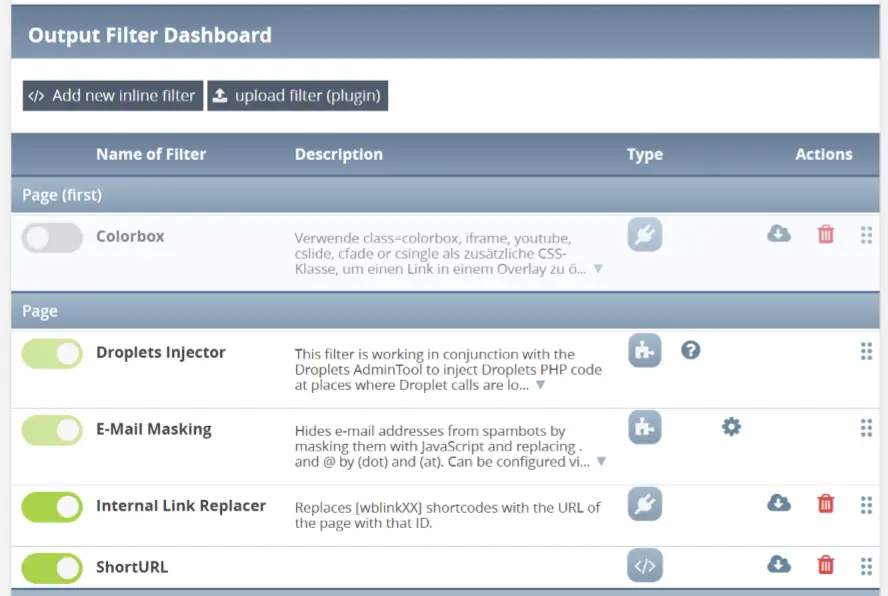

# OutputFilter Dashboard — User Guide

For site administrators. No programming knowledge required.
Writing filters is covered separately in the
[Developer Guide](DEVELOPER_GUIDE.md).

---

## Contents

- [What is an output filter?](#what-is-an-output-filter)
- [Opening the dashboard](#opening-the-dashboard)
- [Reading the filter list](#reading-the-filter-list)
- [Why the order matters](#why-the-order-matters)
- [The filters that come with WBCE](#the-filters-that-come-with-wbce)
- [Installing a filter you received](#installing-a-filter-you-received)
- [Exporting a filter](#exporting-a-filter)
- [Deleting a filter](#deleting-a-filter)
- [The filter settings page](#the-filter-settings-page)
- [Deciding where a filter runs](#deciding-where-a-filter-runs)
- [Filters in the backend, and the emergency switch](#filters-in-the-backend-and-the-emergency-switch)
- [The CSS editor](#the-css-editor)
- [Adding a filter of your own](#adding-a-filter-of-your-own)
- [Troubleshooting](#troubleshooting)

---

## What is an output filter?

When a visitor opens a page, WBCE assembles it from many parts: the template,
the menu, the content of every section, output from snippets. Just before the
finished HTML is sent to the browser, WBCE hands it to a chain of **output
filters** — small pieces of code that are allowed to read that HTML and change
it.

That is how a number of everyday WBCE features actually work:

- A Droplet call you typed into a page, `[[MyDroplet]]`, is still literal text
  when the page is assembled. A filter finds it and replaces it with the
  Droplet's output.
- A link token like `[pagelink:12]` is turned into the real URL of page 12 —
  which keeps working even after that page is renamed or moved.
- Stylesheets and scripts that modules asked WBCE to load are written into the
  page's `<head>` and `<body>` at the right spot.

You never have to write a filter to get any of that: WBCE ships with the filters
it needs, already installed and switched on. The dashboard is where you look
when you want to *see* what is running, switch something off, install an extra
filter, or restrict a filter to a part of the site.

## Opening the dashboard

**Admin-Tools → Output Filter Dashboard.**

You need the `admintools` permission. The **Help** link in the tool's top-right
corner opens this documentation in a popup window.

## Reading the filter list



The list shows every installed filter, **grouped by stage** — the grey headings
("Page", "Page (last)", …) mark the groups. Within the list, filters run top to
bottom.

| Column          | What it means                                                                                                                               |
| --------------- | ------------------------------------------------------------------------------------------------------------------------------------------- |
| **Switch**      | Green = active, grey = inactive. Click to toggle; the change is saved immediately. An inactive filter is never executed.                    |
| **Name**        | Click it to open the filter's settings page.                                                                                                |
| **Description** | What the filter does. Long texts are shortened — click **▼** to read the rest.                                                              |
| **Type**        | An icon telling you how this filter was installed, see below. For inline and plugin filters, clicking the icon converts one into the other. |
| **Actions**     | The icons on the right, see below.                                                                                                          |

### The three filter types

| Icon                                    | Type       | Meaning                                                                                                      |
| --------------------------------------- | ---------- | ------------------------------------------------------------------------------------------------------------ |
|                  | **Inline** | The code was typed into the dashboard itself and lives in the database. You can edit, export and delete it.  |
|                  | **Plugin** | Installed from a ZIP package. You can export and delete it; most settings are locked by the plugin's author. |
|  | **Module** | Installed by another module as part of that module. It can only be removed by uninstalling that module.      |

Clicking the icon on an **inline** filter turns it into a plugin, and vice
versa. You are asked to confirm first, because some information is lost on the
way — a plugin's version number and author are not stored on an inline filter.

### The action icons

| Icon                                        | Shown for                 | What it does                                                   |
| ------------------------------------------- | ------------------------- | -------------------------------------------------------------- |
|  | Filters that ship help    | Opens the filter's own help page.                              |
|                        | Filters that have one     | Opens the filter's own settings screen (usually another tool). |
|           | Filters that ship CSS     | Opens the filter's stylesheet in an editor.                    |
|        | Inline and plugin filters | Exports the filter as a ZIP package.                           |
|                    | Inline and plugin filters | Deletes the filter. You are asked to confirm inside the row.   |

Module filters have no export and no delete icon by design — they belong to
their module.

### Reordering

Grab a row by its right-hand drag area and drop it at a new position **within
its own group**. The new order is saved immediately; there is no extra "save"
step.

### Filters you cannot switch off

A few filters have a greyed-out switch. These are the ones WBCE itself depends
on — switch them off and pages stop rendering correctly. As of WBCE 1.7.0 that
is *Internal Link Replacer*, *Replace Contents*, *Class Insert Helper*, *Remove
System PH* and the *Droplets Injector*.

## Why the order matters

Each filter hands its result to the next one, so a filter only ever sees what
the ones before it have already done. That is the whole reason the list is
ordered, and why the stage groups exist.

There are two levels at which a filter can hook in:

| Level      | The filter sees …                                                                   |
| ---------- | ----------------------------------------------------------------------------------- |
| **Module** | The output of one single section, before it is placed into the page template.       |
| **Page**   | The whole assembled page — template, `<head>`, menu, every section, snippet output. |

Each level has ordered variants, and all module stages run before all page
stages:

| Stage          | Runs                                             |
| -------------- | ------------------------------------------------ |
| Module (first) | First of all — before every other module filter. |
| Module         | The normal module stage.                         |
| Module (last)  | After all normal module filters.                 |
| Page (first)   | First on the assembled page.                     |
| Page           | The normal page stage.                           |
| Page (last)    | After all normal page filters.                   |
| Page (final)   | Dead last, on the completely finished page.      |

A practical example: *Remove System PH* cleans up internal markers and must not
run before the filters that still need them — so it sits at *Page (final)*.

## The filters that come with WBCE

All of these are installed and active on a fresh WBCE install. You normally
leave them alone; the descriptions here are so you can recognise what you are
looking at.

| Filter                     | Stage        | What it does                                                                                                                                                                                                                                                        |
| -------------------------- | ------------ | ------------------------------------------------------------------------------------------------------------------------------------------------------------------------------------------------------------------------------------------------------------------- |
| **Colorbox**               | Page (first) | Loads the Colorbox lightbox library, but only on pages that actually use it — a link carrying `class="colorbox"`, `iframe`, `youtube`, `cslide`, `cfade` or `csingle` opens in an overlay instead of a new page. Five visual styles are selectable in its settings. |
| **Internal Link Replacer** | Page         | Turns link tokens into real URLs: `[pagelink:12]` (and the older `[wblink12]`) become the address of page 12, and modules that generate their own pages can register tokens of their own, e.g. `[img_news:7]`. Links stay correct when pages are renamed or moved.  |
| **Droplets Injector**      | Page         | Finds Droplet calls such as `[[MyDroplet]]` and replaces them with what the Droplet produces. Installed by the Droplets module, which is why it has no export icon.                                                                                                 |
| **Replace Contents**       | Page (last)  | Replaces marked content or code inside placeholder blocks.                                                                                                                                                                                                          |
| **Class Insert Helper**    | Page (last)  | Writes every stylesheet, script and meta tag that modules and the template asked for into the correct place in `<head>` and `<body>`. Switching this off breaks the look of the site.                                                                               |
| **Remove System PH**       | Page (final) | Removes internal `<!--(PH)...-->` markers that earlier stages leave behind, so they never reach the browser.                                                                                                                                                        |
| **Assets Cache Busting**   | Page (final) | Adds a version marker to every stylesheet and script address, so visitors' browsers pick up your changes instead of serving an old cached copy. See below.                                                                                                          |

### About Assets Cache Busting

This is the one core filter you may actually want to switch on or off yourself.

Browsers cache CSS and JavaScript files aggressively. After you edit a
stylesheet, a returning visitor may keep seeing the old one for days. With this
filter on, every stylesheet and script address gets the file's modification time
appended (`style.css?1723800000`) — the address changes whenever the file
changes, so the browser fetches it again.

Switching the filter on or off here is the same switch as the cache-busting
option in the **Asset Optimizer** admin tool; there is one setting, whichever
screen you change it on.

Leave it **on** in normal operation. The cost is that visitors re-download a
file after every edit — which is exactly the point.

## Installing a filter you received

Filters distributed as plugins come as a ZIP file.

1. Click **Upload Filter (plugin)** at the top of the dashboard.
2. Choose the ZIP file and click **Upload**.
3. The filter appears in the list, at the bottom of its stage group.

If the upload fails, the panel stays open with the reason shown, so you can pick
a different file without hunting for the button again.

**A word of warning:** a filter is program code that runs on every page of your
site. WBCE checks uploaded packages for broken and obviously dangerous code and
refuses to install those — but that check cannot tell a well-written malicious
filter from a well-written useful one. Only install filters from a source you
trust.

## Exporting a filter

Click the **download** icon on the row. You get a ZIP package back, which you
can keep as a backup or install on another WBCE site.

Two things to know:

- **Inline filters are converted to plugins on export.** The ZIP is always a
  plugin package — that is the only portable format.
- **Module filters cannot be exported.** They are part of their module; copy the
  module instead.

## Deleting a filter

Click the **trash** icon. The row turns into a confirmation prompt — confirm and
the filter is gone.

Only inline and plugin filters can be deleted. To get rid of a module filter,
uninstall the module it belongs to.

Deleting is permanent. If there is any chance you will want the filter back,
export it first.

## The filter settings page

Click a filter's **name** to open it. How much of this page you can actually
change depends on the filter: the author of a plugin or module filter decides
whether its settings are editable at all, and many lock everything except the
page and module targeting. Locked fields are shown greyed out.

**Filter configuration**

| Field              | Meaning                                                                     |
| ------------------ | --------------------------------------------------------------------------- |
| Switch (top right) | Active / inactive — the same switch as in the list.                         |
| Name               | The filter's name. Must be unique across all filters.                       |
| Description        | Free text. This is what the dashboard list shows in the description column. |

**Filter Output-Settings (Pages/Modules)**

| Field            | Meaning                                                                                                                                  |
| ---------------- | ---------------------------------------------------------------------------------------------------------------------------------------- |
| Type             | Which stage the filter runs at — see [Why the order matters](#why-the-order-matters). Changing it moves the filter to a different group. |
| Apply to modules | Only shown for the module stages. Which section types the filter should run on.                                                          |
| Apply to pages   | Only shown for the page stages. Which pages the filter should run on.                                                                    |

**Function**

| Field            | Meaning                                                                                                                                              |
| ---------------- | ---------------------------------------------------------------------------------------------------------------------------------------------------- |
| Name of function | The name of the PHP function that does the work. Unique across all filters. Leave the suggested value alone unless you know why you are changing it. |
| Filter file      | For plugin and module filters: the file on disk containing the code, shown read-only.                                                                |
| Code editor      | For inline filters: the filter's code. It only appears once the filter has been saved for the first time.                                            |

A filter may add **extra settings fields** of its own below this — text fields,
dropdowns, checkboxes. What they do is up to the filter; look at its help page
or its description.

Finish with **Save** (stays on the page) or **Save & Back** (returns to the
list). **Cancel** discards your changes.

If a save is rejected — for instance because the code does not compile — you
stay on the page, an error message names the problem, and what you typed is kept
so you can fix it. Nothing is lost.

## Deciding where a filter runs

A filter that runs on every page of the site when it is only needed on two costs
you time on every single request. The two tree views on the settings page are
how you narrow that down.

**Apply filter to these modules** (module stages only) — tick the section types
the filter should apply to. "All Modules" means exactly that; untick the ones
that do not need it.

**Apply filter to these pages** (page stages only) — the page tree. A page that
has sub-pages appears twice:

- **Single page** — this page only.
- **Page hierarchy** — this page *and* everything below it. Use this one for a  whole branch of the site.

A dash instead of a tick on a branch means "some of the pages below this are
selected, but not all".

**Examples**

- A filter that should touch every WYSIWYG section on the site: tick *WYSIWYG*  in the module tree and *All pages* in the page tree.
- The same filter on WYSIWYG and News sections, but only on two pages: tick  *WYSIWYG* and *News*, then those two pages as **Single page**.
- A filter for a whole branch — a "Products" page and every product page under  it: tick *Products* as **Page hierarchy**.

## Filters in the backend, and the emergency switch

The page tree also contains a **Backend** entry, next to "All pages". Tick it
and the filter is applied to WBCE's own admin screens as well as (or instead of)
the public site.

This is genuinely useful — the core filters use it — but it carries an obvious
risk: a filter that breaks the backend breaks the very screen you would use to
switch it off again. For that case, add this line to your `config.php`:

```php
define('WB_OPF_BE_OFF', 'off');
```

While that line is present, **no filter is applied to the backend at all**. You
can reach the dashboard again, fix or disable the offending filter, and then
remove the line. The value does not matter — only that the constant exists.

Targeting one *specific* backend tool is not possible from this screen; the
Backend checkbox is all-or-nothing.

## The CSS editor

Some filters ship a stylesheet of their own. Those rows get a **document** icon
that opens that file in an editor, so you can adjust it without touching the
filesystem.

Bear in mind that this edits a file inside the filter's own folder: **an update
of that filter or plugin will overwrite your changes.** For anything you want to
keep, put your rules in your template's stylesheet instead.

## Adding a filter of your own

Click **New inline filter**. You will be asked for a name, a description, a
stage, and the pages/modules the filter applies to. Save once — the code editor
then appears on the settings page, and that is where the actual filter code
goes.

Writing that code is a programming task, covered in the
[Developer Guide](DEVELOPER_GUIDE.md). Two things are worth knowing even if
someone else writes the code for you:

- **The code is checked before it is stored.** Code that does not compile, or  that uses constructs not allowed in filters, is refused outright — a broken  filter can never reach the live site through this form.
- **Nothing is lost on a rejected save.** Your text stays in the editor with the  offending line highlighted.

## Troubleshooting

**A filter does nothing.**
Check, in this order: is its switch green; is the current page ticked in its
page tree (and the module ticked in its module tree); is it in the right stage
group — a filter that needs the finished page will see nothing useful at a
module stage.

**The site looks unstyled after I changed something.**
Most likely *Class Insert Helper* got switched off or moved. It must be active,
and it must run after the filters that queue up stylesheets. Switch it back on.

**I switched something off and now the backend is broken.**
Add `define('WB_OPF_BE_OFF', 'off');` to `config.php`, fix it in the dashboard,
then remove the line again. See
[Filters in the backend](#filters-in-the-backend-and-the-emergency-switch).

**Visitors still see the old stylesheet.**
Switch on *Assets Cache Busting*. See
[About Assets Cache Busting](#about-assets-cache-busting).

**A filter cannot be saved.**
Read the error message at the top — it names the line and the reason. The most
common causes are a name that is already in use, and code that does not compile.

**Drag & drop does nothing.**
The dashboard needs JavaScript. If you see the "please activate JavaScript"
warning at the top, that is the cause.

---

*OutputFilter Dashboard documentation — CC BY-SA 3.0 DE. See
[LICENSE.md](../LICENSE.md).*
