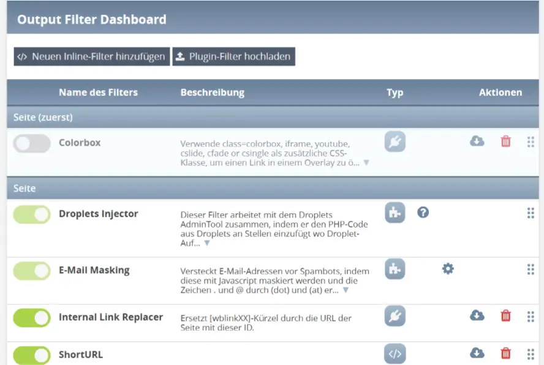

# OutputFilter Dashboard — Handbuch

Für Administratoren und Redakteure. Programmierkenntnisse sind nicht nötig.
Wie man selbst Filter schreibt, steht im
[Entwicklerhandbuch](DEVELOPER_GUIDE_DE.md).

---

## Inhalt

- [Was ist ein Outputfilter?](#was-ist-ein-outputfilter)
- [Das Dashboard öffnen](#das-dashboard-offnen)
- [Die Filterliste lesen](#die-filterliste-lesen)
- [Warum die Reihenfolge zählt](#warum-die-reihenfolge-zahlt)
- [Die Filter, die mit WBCE mitkommen](#die-filter-die-mit-wbce-mitkommen)
- [Einen erhaltenen Filter installieren](#einen-erhaltenen-filter-installieren)
- [Einen Filter exportieren](#einen-filter-exportieren)
- [Einen Filter löschen](#einen-filter-loschen)
- [Die Einstellungsseite eines Filters](#die-einstellungsseite-eines-filters)
- [Festlegen, wo ein Filter läuft](#festlegen-wo-ein-filter-lauft)
- [Filter im Backend, und der Notausschalter](#filter-im-backend-und-der-notausschalter)
- [Der CSS-Editor](#der-css-editor)
- [Einen eigenen Filter anlegen](#einen-eigenen-filter-anlegen)
- [Fehlersuche](#fehlersuche)

---

<a id="was-ist-ein-outputfilter"></a>

## Was ist ein Outputfilter?

Wenn ein Besucher eine Seite öffnet, setzt WBCE sie aus vielen Teilen zusammen:
dem Template, dem Menü, dem Inhalt jeder Section, der Ausgabe von Snippets. Kurz
bevor das fertige HTML an den Browser geht, reicht WBCE es durch eine Kette von
**Outputfiltern** — kleinen Codestücken, die dieses HTML lesen und verändern
dürfen.

So funktionieren etliche alltägliche WBCE-Funktionen tatsächlich:

- Ein Droplet-Aufruf, den du in eine Seite geschrieben hast, `[[MeinDroplet]]`,
  ist beim Zusammenbau noch wörtlicher Text. Ein Filter findet ihn und ersetzt
  ihn durch die Ausgabe des Droplets.
- Ein Link-Token wie `[pagelink:12]` wird zur echten URL von Seite 12 — und
  bleibt richtig, auch wenn die Seite später umbenannt oder verschoben wird.
- Stylesheets und Skripte, die Module angefordert haben, landen an der richtigen
  Stelle im `<head>` und `<body>` der Seite.

Für all das musst du nie einen Filter schreiben: WBCE bringt die Filter mit, die
es braucht, fertig installiert und eingeschaltet. Das Dashboard ist der Ort, an
den du gehst, wenn du *sehen* willst, was läuft, wenn du etwas abschalten,
einen zusätzlichen Filter installieren oder einen Filter auf einen Teil der
Website begrenzen willst.

<a id="das-dashboard-offnen"></a>

## Das Dashboard öffnen

**Admin-Tools → Output Filter Dashboard.**

Du brauchst das Recht `admintools`. Der **Hilfe**-Link oben rechts im Tool
öffnet diese Dokumentation in einem eigenen Fenster.

<a id="die-filterliste-lesen"></a>

## Die Filterliste lesen



Die Liste zeigt jeden installierten Filter, **gruppiert nach Stufe** — die
grauen Zwischenüberschriften („Page", „Page (last)", …) markieren die Gruppen.
Innerhalb der Liste laufen die Filter von oben nach unten.

| Spalte           | Was sie bedeutet                                                                                                                                       |
| ---------------- | ------------------------------------------------------------------------------------------------------------------------------------------------------ |
| **Schalter**     | Grün = aktiv, grau = inaktiv. Klick schaltet um; die Änderung wird sofort gespeichert. Ein inaktiver Filter wird nie ausgeführt.                       |
| **Name**         | Klick öffnet die Einstellungsseite des Filters.                                                                                                        |
| **Beschreibung** | Was der Filter tut. Lange Texte werden gekürzt — **▼** zeigt den Rest.                                                                                 |
| **Typ**          | Ein Symbol, das zeigt, wie dieser Filter installiert wurde, siehe unten. Bei Inline- und Plugin-Filtern wandelt ein Klick den einen in den anderen um. |
| **Aktionen**     | Die Symbole rechts, siehe unten.                                                                                                                       |

### Die drei Filtertypen

| Symbol                                | Typ        | Bedeutung                                                                                                                 |
| ------------------------------------- | ---------- | ------------------------------------------------------------------------------------------------------------------------- |
|                | **Inline** | Der Code wurde direkt im Dashboard eingetippt und liegt in der Datenbank. Du kannst ihn bearbeiten, exportieren, löschen. |
|             | **Plugin** | Aus einem ZIP-Paket installiert. Exportieren und löschen ist möglich; die meisten Einstellungen sperrt der Autor.         |
|  | **Modul**  | Von einem anderen Modul als dessen Bestandteil installiert. Entfernbar nur, indem man dieses Modul deinstalliert.         |

Ein Klick auf das Symbol eines **Inline**-Filters macht daraus ein Plugin und
umgekehrt. Du wirst vorher gefragt, denn dabei gehen Angaben verloren — die
Versionsnummer und der Autor eines Plugins werden an einem Inline-Filter nicht
gespeichert.

### Die Aktions-Symbole

| Symbol                                     | Erscheint bei              | Was passiert                                                            |
| ------------------------------------------ | -------------------------- | ----------------------------------------------------------------------- |
|  | Filtern mit eigener Hilfe  | Öffnet die Hilfeseite des Filters.                                      |
|                   | Filtern mit eigener Konfig | Öffnet die Einstellungsseite des Filters (meist ein anderes Tool).      |
|          | Filtern mit eigenem CSS    | Öffnet das Stylesheet des Filters in einem Editor.                      |
|       | Inline- und Plugin-Filtern | Exportiert den Filter als ZIP-Paket.                                    |
|              | Inline- und Plugin-Filtern | Löscht den Filter. Du wirst direkt in der Zeile um Bestätigung gebeten. |

Modul-Filter haben bewusst kein Export- und kein Lösch-Symbol — sie gehören zu
ihrem Modul.

### Umsortieren

Fasse eine Zeile am Ziehbereich rechts an und lass sie an einer neuen Position
**innerhalb ihrer eigenen Gruppe** los. Die neue Reihenfolge wird sofort
gespeichert; ein zusätzliches „Speichern" gibt es nicht.

### Filter, die sich nicht abschalten lassen

Bei einigen Filtern ist der Schalter ausgegraut. Das sind die, auf die WBCE
selbst angewiesen ist — schaltet man sie ab, werden Seiten nicht mehr korrekt
ausgegeben. Mit WBCE 1.7.0 sind das *Internal Link Replacer*, *Replace
Contents*, *Class Insert Helper*, *Remove System PH* und der *Droplets
Injector*.

<a id="warum-die-reihenfolge-zahlt"></a>

## Warum die Reihenfolge zählt

Jeder Filter reicht sein Ergebnis an den nächsten weiter, sieht also immer nur
das, was die Filter vor ihm bereits angerichtet haben. Genau deshalb ist die
Liste geordnet, und genau deshalb gibt es die Stufen-Gruppen.

Es gibt zwei Ebenen, auf denen ein Filter ansetzen kann:

| Ebene     | Der Filter sieht …                                                                          |
| --------- | ------------------------------------------------------------------------------------------- |
| **Modul** | Die Ausgabe einer einzelnen Section, bevor sie ins Seiten-Template eingesetzt wird.         |
| **Page**  | Die ganze zusammengebaute Seite — Template, `<head>`, Menü, jede Section, Snippet-Ausgaben. |

Jede Ebene hat geordnete Varianten, und alle Modul-Stufen laufen vor allen
Page-Stufen:

| Stufe          | Läuft                                             |
| -------------- | ------------------------------------------------- |
| Module (first) | Ganz zuerst — vor jedem anderen Modul-Filter.     |
| Module         | Die normale Modul-Stufe.                          |
| Module (last)  | Nach allen normalen Modul-Filtern.                |
| Page (first)   | Als Erstes auf der zusammengebauten Seite.        |
| Page           | Die normale Page-Stufe.                           |
| Page (last)    | Nach allen normalen Page-Filtern.                 |
| Page (final)   | Ganz zuletzt, auf der vollständig fertigen Seite. |

Ein praktisches Beispiel: *Remove System PH* räumt interne Marker weg und darf
nicht vor den Filtern laufen, die diese Marker noch brauchen — deshalb sitzt er
auf *Page (final)*.

<a id="die-filter-die-mit-wbce-mitkommen"></a>

## Die Filter, die mit WBCE mitkommen

Alle diese sind auf einer frischen WBCE-Installation vorhanden und aktiv.
Normalerweise lässt du sie in Ruhe; die Beschreibungen hier sind dafür da, dass
du erkennst, was du vor dir hast.

| Filter                     | Stufe        | Was er tut                                                                                                                                                                                                                                                                                |
| -------------------------- | ------------ | ----------------------------------------------------------------------------------------------------------------------------------------------------------------------------------------------------------------------------------------------------------------------------------------- |
| **Colorbox**               | Page (first) | Lädt die Colorbox-Lightbox, aber nur auf Seiten, die sie auch verwenden — ein Link mit `class="colorbox"`, `iframe`, `youtube`, `cslide`, `cfade` oder `csingle` öffnet sich dann in einer Overlay-Box statt auf einer neuen Seite. Fünf Optiken sind in den Filtereinstellungen wählbar. |
| **Internal Link Replacer** | Page         | Macht aus Link-Tokens echte URLs: `[pagelink:12]` (und das ältere `[wblink12]`) werden zur Adresse von Seite 12, und Module, die eigene Seiten erzeugen, können eigene Tokens registrieren, z. B. `[img_news:7]`. Links bleiben korrekt, wenn Seiten umbenannt oder verschoben werden.    |
| **Droplets Injector**      | Page         | Findet Droplet-Aufrufe wie `[[MeinDroplet]]` und ersetzt sie durch das, was das Droplet erzeugt. Wird vom Droplets-Modul installiert — deshalb hat er kein Export-Symbol.                                                                                                                 |
| **Replace Contents**       | Page (last)  | Ersetzt markierte Inhalte oder Code innerhalb von Platzhalter-Blöcken.                                                                                                                                                                                                                    |
| **Class Insert Helper**    | Page (last)  | Schreibt jedes Stylesheet, Skript und Meta-Tag, das Module und Template angefordert haben, an die richtige Stelle in `<head>` und `<body>`. Schaltet man ihn ab, verliert die Website ihr Aussehen.                                                                                       |
| **Remove System PH**       | Page (final) | Entfernt interne `<!--(PH)...-->`-Marker, die frühere Stufen hinterlassen, damit sie nie beim Browser ankommen.                                                                                                                                                                           |
| **Assets Cache Busting**   | Page (final) | Hängt an jede Stylesheet- und Skript-Adresse eine Versionsmarke, damit Besucher deine Änderungen sehen statt einer alten Kopie aus ihrem Zwischenspeicher. Siehe unten.                                                                                                                   |

<a id="uber-assets-cache-busting"></a>

### Über Assets Cache Busting

Das ist der eine Kernfilter, den du tatsächlich selbst ein- oder ausschalten
willst.

Browser speichern CSS- und JavaScript-Dateien hartnäckig zwischen. Nachdem du
ein Stylesheet geändert hast, kann ein wiederkehrender Besucher noch tagelang
das alte sehen. Mit eingeschaltetem Filter bekommt jede Stylesheet- und
Skript-Adresse den Änderungszeitpunkt der Datei angehängt
(`style.css?1723800000`) — die Adresse ändert sich also, sobald sich die Datei
ändert, und der Browser holt sie neu.

Den Filter hier ein- oder auszuschalten ist derselbe Schalter wie die
Cache-Busting-Option im Admin-Tool **Asset Optimizer**; es gibt nur eine
Einstellung, egal auf welchem Bildschirm du sie änderst.

Lass ihn im normalen Betrieb **an**. Der Preis ist, dass Besucher eine Datei
nach jeder Änderung neu laden — und genau das ist der Sinn.

<a id="einen-erhaltenen-filter-installieren"></a>

## Einen erhaltenen Filter installieren

Filter, die als Plugin weitergegeben werden, kommen als ZIP-Datei.

1. Klick oben im Dashboard auf **Plugin-Filter hochladen**.
2. ZIP-Datei auswählen und auf **Hochladen** klicken.
3. Der Filter erscheint in der Liste, unten in seiner Stufen-Gruppe.

Schlägt der Upload fehl, bleibt das Feld mit der Begründung offen, damit du eine
andere Datei wählen kannst, ohne den Knopf erneut suchen zu müssen.

**Eine Warnung:** Ein Filter ist Programmcode, der auf jeder Seite deiner
Website läuft. WBCE prüft hochgeladene Pakete auf kaputten und offensichtlich
gefährlichen Code und verweigert die Installation solcher Pakete — aber diese
Prüfung kann einen gut geschriebenen bösartigen Filter nicht von einem gut
geschriebenen nützlichen unterscheiden. Installiere nur Filter aus einer Quelle,
der du vertraust.

<a id="einen-filter-exportieren"></a>

## Einen Filter exportieren

Klick auf das **Download**-Symbol der Zeile. Du bekommst ein ZIP-Paket zurück,
das du als Sicherung aufbewahren oder auf einer anderen WBCE-Website
installieren kannst.

Zwei Dinge dazu:

- **Inline-Filter werden beim Export in Plugins umgewandelt.** Das ZIP ist immer
  ein Plugin-Paket — das ist das einzige übertragbare Format.
- **Modul-Filter lassen sich nicht exportieren.** Sie gehören zu ihrem Modul;
  kopiere stattdessen das Modul.

<a id="einen-filter-loschen"></a>

## Einen Filter löschen

Klick auf das **Papierkorb**-Symbol. Die Zeile wird zur Rückfrage — bestätigen,
und der Filter ist weg.

Löschen lassen sich nur Inline- und Plugin-Filter. Einen Modul-Filter wirst du
los, indem du das Modul deinstallierst, zu dem er gehört.

Löschen ist endgültig. Wenn auch nur die Möglichkeit besteht, dass du den Filter
wiederhaben willst, exportiere ihn vorher.

<a id="die-einstellungsseite-eines-filters"></a>

## Die Einstellungsseite eines Filters

Klick auf den **Namen** eines Filters, um sie zu öffnen. Wie viel du hier
tatsächlich ändern kannst, hängt vom Filter ab: Der Autor eines Plugin- oder
Modul-Filters entscheidet, ob dessen Einstellungen überhaupt änderbar sind, und
viele sperren alles außer der Seiten- und Modul-Zuordnung. Gesperrte Felder
werden ausgegraut dargestellt.

**Filter-Konfiguration**

| Feld                | Bedeutung                                                                      |
| ------------------- | ------------------------------------------------------------------------------ |
| Schalter (oben re.) | Aktiv / inaktiv — derselbe Schalter wie in der Liste.                          |
| Name                | Der Name des Filters. Muss über alle Filter hinweg eindeutig sein.             |
| Beschreibung        | Freitext. Das ist, was die Dashboard-Liste in der Beschreibungsspalte anzeigt. |

**Filter-Ausgabeeinstellungen (Seiten/Module)**

| Feld             | Bedeutung                                                                                                                                                   |
| ---------------- | ----------------------------------------------------------------------------------------------------------------------------------------------------------- |
| Typ              | Auf welcher Stufe der Filter läuft — siehe [Warum die Reihenfolge zählt](#warum-die-reihenfolge-zahlt). Eine Änderung verschiebt ihn in eine andere Gruppe. |
| Auf diese Module | Nur bei den Modul-Stufen sichtbar. Auf welche Section-Typen der Filter angewendet wird.                                                                     |
| Auf diese Seiten | Nur bei den Page-Stufen sichtbar. Auf welche Seiten der Filter angewendet wird.                                                                             |

**Funktion**

| Feld              | Bedeutung                                                                                                                                                 |
| ----------------- | --------------------------------------------------------------------------------------------------------------------------------------------------------- |
| Name der Funktion | Der Name der PHP-Funktion, die die Arbeit macht. Über alle Filter hinweg eindeutig. Lass die Vorgabe stehen, solange du keinen Grund hast, sie zu ändern. |
| Filter-Datei      | Bei Plugin- und Modul-Filtern: die Datei auf der Festplatte, die den Code enthält — nur lesbar angezeigt.                                                 |
| Code-Editor       | Bei Inline-Filtern: der Code des Filters. Er erscheint erst, nachdem der Filter einmal gespeichert wurde.                                                 |

Ein Filter kann darunter **eigene Zusatzfelder** einblenden — Textfelder,
Auswahllisten, Checkboxen. Was sie bewirken, bestimmt der Filter; sieh in seine
Hilfeseite oder seine Beschreibung.

Zum Abschluss **Speichern** (bleibt auf der Seite) oder **Speichern & Zurück**
(geht zurück zur Liste). **Abbrechen** verwirft deine Änderungen.

Wird ein Speichern abgelehnt — etwa weil der Code sich nicht übersetzen lässt —
bleibst du auf der Seite, eine Fehlermeldung benennt das Problem, und was du
eingetippt hast, bleibt erhalten. Es geht nichts verloren.

<a id="festlegen-wo-ein-filter-lauft"></a>

## Festlegen, wo ein Filter läuft

Ein Filter, der auf jeder Seite der Website läuft, obwohl er nur auf zweien
gebraucht wird, kostet bei jedem einzelnen Aufruf Zeit. Die beiden Baumansichten
auf der Einstellungsseite sind das Mittel dagegen.

**Filter auf diese Module anwenden** (nur bei Modul-Stufen) — hake die
Section-Typen an, für die der Filter gelten soll. „Alle Module" heißt genau das;
nimm die Haken bei denen weg, die ihn nicht brauchen.

**Filter auf diese Seiten anwenden** (nur bei Page-Stufen) — der Seitenbaum.
Eine Seite mit Unterseiten taucht zweimal auf:

- **Einzelne Seite** — nur diese Seite.
- **Seitenhierarchie** — diese Seite *und* alles darunter. Diese Variante nimmst
  du für einen ganzen Zweig der Website.

Ein Strich statt eines Hakens an einem Zweig bedeutet „einige der Seiten
darunter sind ausgewählt, aber nicht alle".

**Beispiele**

- Ein Filter, der jede WYSIWYG-Section der Website erfassen soll: *WYSIWYG* im
  Modulbaum anhaken und *Alle Seiten* im Seitenbaum.
- Derselbe Filter für WYSIWYG- und News-Sections, aber nur auf zwei Seiten:
  *WYSIWYG* und *News* anhaken, dann diese beiden Seiten als **Einzelne Seite**.
- Ein Filter für einen ganzen Zweig — eine Seite „Produkte" und jede
  Produktseite darunter: *Produkte* als **Seitenhierarchie** anhaken.

<a id="filter-im-backend-und-der-notausschalter"></a>

## Filter im Backend, und der Notausschalter

Im Seitenbaum steht neben „Alle Seiten" auch ein Eintrag **Backend**. Hake ihn
an, und der Filter wird zusätzlich zu (oder anstelle von) den öffentlichen
Seiten auch auf die Verwaltungsoberfläche von WBCE angewendet.

Das ist durchaus nützlich — die Kernfilter machen es —, birgt aber ein
offensichtliches Risiko: Ein Filter, der das Backend zerlegt, zerlegt genau den
Bildschirm, über den du ihn wieder abschalten würdest. Für diesen Fall trägst du
diese Zeile in deine `config.php` ein:

```php
define('WB_OPF_BE_OFF', 'off');
```

Solange diese Zeile dort steht, wird **überhaupt kein Filter auf das Backend
angewendet**. Du kommst wieder ans Dashboard, reparierst oder deaktivierst den
störenden Filter und entfernst die Zeile anschließend wieder. Der Wert spielt
keine Rolle — nur, dass die Konstante existiert.

Ein *einzelnes* Backend-Tool lässt sich über diesen Bildschirm nicht ansteuern;
die Backend-Checkbox ist alles oder nichts.

<a id="der-css-editor"></a>

## Der CSS-Editor

Manche Filter bringen ein eigenes Stylesheet mit. Diese Zeilen bekommen ein
**Dokument**-Symbol, das die Datei in einem Editor öffnet, damit du sie anpassen
kannst, ohne ins Dateisystem zu gehen.

Denk daran, dass hier eine Datei im Ordner des Filters bearbeitet wird: **ein
Update dieses Filters oder Plugins überschreibt deine Änderungen.** Alles, was
bleiben soll, gehört ins Stylesheet deines Templates.

<a id="einen-eigenen-filter-anlegen"></a>

## Einen eigenen Filter anlegen

Klick auf **Neuer Inline-Filter**. Du wirst nach Name, Beschreibung, Stufe und
den Seiten/Modulen gefragt, für die der Filter gelten soll. Einmal speichern —
danach erscheint der Code-Editor auf der Einstellungsseite, und dort kommt der
eigentliche Filtercode hinein.

Diesen Code zu schreiben ist Programmierarbeit und steht im
[Entwicklerhandbuch](DEVELOPER_GUIDE_DE.md). Zwei Dinge lohnt es zu wissen,
selbst wenn jemand anderes den Code schreibt:

- **Der Code wird vor dem Speichern geprüft.** Code, der sich nicht übersetzen
  lässt oder Konstrukte verwendet, die in Filtern nicht erlaubt sind, wird
  rundheraus abgelehnt — ein kaputter Filter kann über dieses Formular niemals
  auf die Live-Website gelangen.
- **Bei einer Ablehnung geht nichts verloren.** Dein Text bleibt im Editor
  stehen, die beanstandete Zeile ist hervorgehoben.

<a id="fehlersuche"></a>

## Fehlersuche

**Ein Filter tut nichts.**
Prüfe in dieser Reihenfolge: Ist sein Schalter grün? Ist die aktuelle Seite in
seinem Seitenbaum angehakt (und das Modul im Modulbaum)? Ist er in der richtigen
Stufen-Gruppe — ein Filter, der die fertige Seite braucht, sieht auf einer
Modul-Stufe nichts Brauchbares.

**Die Website sieht nach einer Änderung ungestylt aus.**
Höchstwahrscheinlich wurde *Class Insert Helper* abgeschaltet oder verschoben.
Er muss aktiv sein und nach den Filtern laufen, die Stylesheets einreihen.
Schalte ihn wieder ein.

**Ich habe etwas abgeschaltet und jetzt ist das Backend kaputt.**
Trag `define('WB_OPF_BE_OFF', 'off');` in die `config.php` ein, repariere es im
Dashboard und entferne die Zeile wieder. Siehe
[Filter im Backend](#filter-im-backend-und-der-notausschalter).

**Besucher sehen immer noch das alte Stylesheet.**
Schalte *Assets Cache Busting* ein. Siehe
[Über Assets Cache Busting](#uber-assets-cache-busting).

**Ein Filter lässt sich nicht speichern.**
Lies die Fehlermeldung oben — sie benennt Zeile und Grund. Die häufigsten
Ursachen sind ein bereits vergebener Name und Code, der sich nicht übersetzen
lässt.

**Drag & Drop tut nichts.**
Das Dashboard braucht JavaScript. Wenn oben die Warnung „bitte JavaScript
aktivieren" steht, ist das die Ursache.

---

*OutputFilter-Dashboard-Dokumentation — CC BY-SA 3.0 DE. Siehe
[LICENSE.md](../LICENSE.md).*
